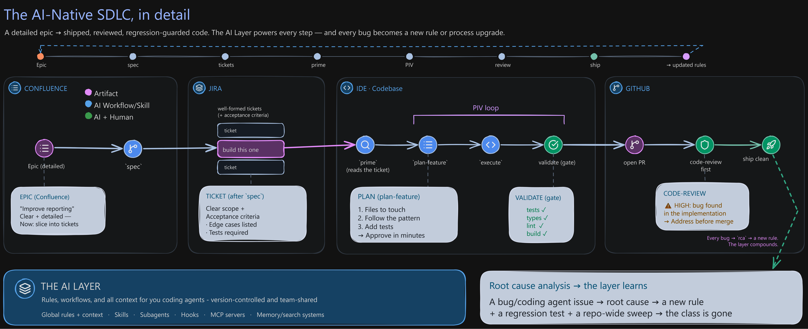

# AI Layer Starter Pack

The reusable **AI Layer** for agentic engineering - the skills, agents, and reference
docs you install **once** into any codebase. This is the generic foundation used in the
free *"AI-Native Engineering Org"* workshop: you install this, then **derive the rest from
your own code** and wire it into your team's process.

> **Install once → customize from your codebase.** The pack is intentionally generic.
> The codebase-specific part of the AI Layer - your `CLAUDE.md` rules and on-demand
> `.claude/context/` modules - you generate with the **`/create-rules`** skill below,
> reading *your* actual code. That's the whole idea: the AI Layer is your team's own
> knowledge and process, encoded.

## Install

```bash
# 1. Clone this pack
git clone https://github.com/coleam00/ai-native-starter-pack
# 2. Copy the AI Layer into your project (skills/agents/references + the Atlassian .mcp.json)
cp -r ai-native-starter-pack/.claude <your-repo>/.claude
cp ai-native-starter-pack/.mcp.json <your-repo>/.mcp.json
# 3. In your repo, derive your rules from your real code:
#    run  /create-rules   → writes CLAUDE.md + .claude/context/ (cited to your code)
# 4. Wire external context: the pack ships a .mcp.json for the Atlassian MCP (Jira +
#    Confluence) - edit/replace it for your stack - then
#    run  /prime <jira-keys> <confluence-page-ids>
```

(Git submodule also works if you want to track upstream updates.)

## What's in here

**Context & priming**
- `prime` - load codebase context; optionally pull Jira issues + Confluence pages first (`prime [jira-keys] [confluence-page-ids]`, via the Atlassian MCP)
- `prime-backend` / `prime-frontend` - focused priming for one side of a full-stack repo

**Build the layer (codebase-specific, derived)**
- `create-rules` - **derive `CLAUDE.md` + `.claude/context/` from your real codebase** (Brownfield Type A). The one you run first per project.
- `create-prd` - greenfield: turn an idea into a PRD

**The PIV loop** (Plan → Implement → Validate - the core methodology)
- `plan-feature` - **P**lan: a context-rich, one-pass implementation plan
- `execute` - **I**mplement: build strictly from the approved plan
- `validate` - **V**alidate: run the project's tests / type-check / lint / build before a PR
- `commit` - structured commit at the end of a loop

**Review**
- `code-review` (+ the `code-reviewer` agent) - first-pass review on a diff/PR
- `code-review-fix` - apply review findings

**System evolution** (improve the AI Layer over time)
- `rca` - root-cause a bug *and* propose a rule + regression test so the class can't recur
- `system-review` - diff intent vs outcome; surface rules/context to tighten
- `execution-report` - capture what a loop actually did vs the plan

**Slicing & parallelism**
- `spec` - slice an epic / PRD into PIV-sized tickets with a dependency graph
- `new-worktrees` / `merge-worktrees` - run independent tickets in parallel git worktrees

**Examples / extras**
- `end-to-end-feature`, `implement-fix`, `ast-grep`, `init-project` - additional reusable skills

**Agents:** `code-reviewer`, `system-reviewer`, `research-agent`
**References (universal best-practice):** `architecture-patterns`, `backend-api-best-practices`, `frontend-component-best-practices`, `vertical-slice-architecture`
**MCP wiring:** `.mcp.json` - ships pointing at the **Atlassian MCP** (Jira + Confluence) so `prime` can pull tickets + linked spec pages out of the box; edit it to point at your own stack.

## The diagrams from the workshop

The maps from the live session, free to reuse.

### The AI Layer at a glance

What actually goes in the layer: global rules and on-demand context, skills and agents, then the
wiring (MCP, hooks, LSP) that connects the agent to the tools you already use.


### The same epic, two systems

The whole workshop in one frame. Same Confluence epic down two paths: one where the team burns
its time cleaning up slop, one where it ships. The only difference is the AI Layer.


### The AI-Native SDLC, in detail

The same flow with the tool zones (Confluence, Jira, your IDE, GitHub), the artifact produced at
each step, and the bug-to-rule loop that feeds the layer back into the next ticket.



## Relationship to the Dynamous Agentic Coding course

This is a **focused subset** for the 2-hour workshop - enough to build the AI Layer and run
the PIV loop + system evolution end-to-end. The full **Dynamous Agentic Coding course** goes
much deeper across many more modules, commands, subagents, and the complete validation,
remote-coding, MCP, and Archon workflows. This pack is the on-ramp.

## License / use

Free to use. Built for attendees of the *"AI-Native Engineering Org Transformation"* workshop, but
you don't need to have been there. Clone it, install it, make it yours.
